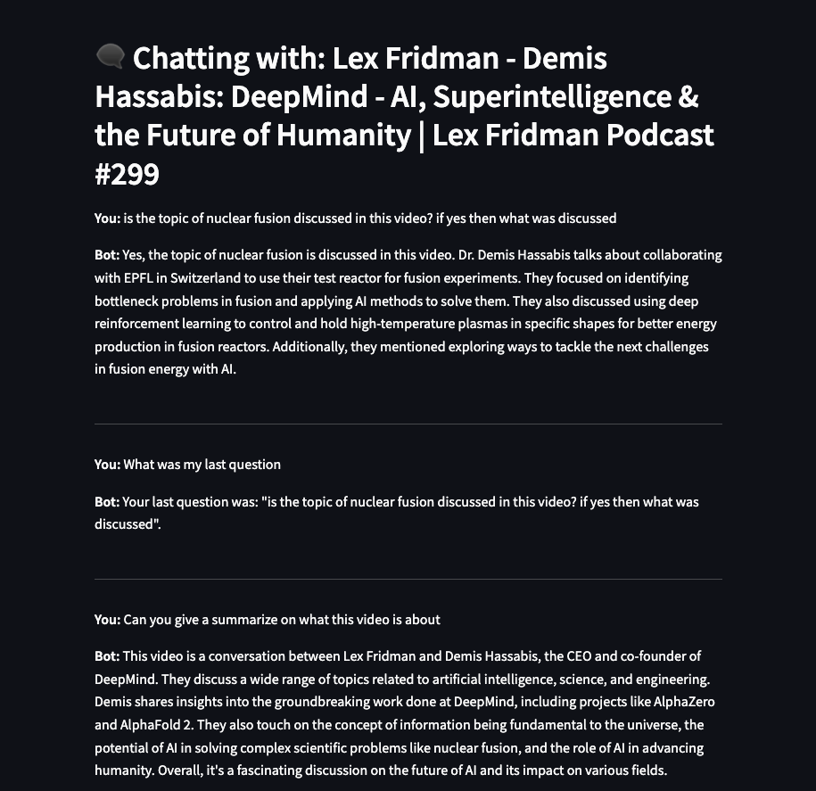

# 🎥 YouTube Transcript Chatbot (with Streamlit UI) 🤖

An AI-powered chatbot that ingests YouTube video transcripts, stores them in a FAISS vector database, and enables semantic search & chat interaction — all through a sleek Streamlit-based UI!  
Built with LangChain, FAISS, OpenAI embeddings, and optimized for async ingestion.

---

## 🚀 Features

- 🔎 **Semantic Search** over YouTube video transcripts
- 🧠 **Chatbot** interface powered by OpenAI models (`gpt-3.5`, `gpt-4`, etc.)
- 🗂️ **Vector Store** backed by FAISS for fast similarity search
- 📝 **Chunking & Ingestion** using LangChain's text splitter
- ⏱️ **Async Processing** for batch ingestion of multiple video IDs
- 🌐 **Streamlit-based** web UI for chat and ingestion
- ✅ **Memory Handler** support for chat history tracking (Human ↔️ AI records)
- 📄 **Excel Logging** of chat records with timezone-safe datetime handling

---

## 🛠️ Tech Stack

| Technology  | Purpose                    |
| ----------- | -------------------------- |
| **Streamlit** | Frontend UI for chat & ingestion |
| **LangChain** | Prompt management, retrievers, memory |
| **FAISS**   | Vector database for embeddings |
| **OpenAI API** | Embedding and LLM models   |
| **Pytube**  | Fetch video metadata        |
| **YouTube Transcript API** | Fetch transcripts |
| **Pandas**  | Record-keeping, Excel export |

---

## 📦 Project Structure

YOUTUBE_CHATBOT/
├── faiss_transcript_index/     # FAISS vector store data
├── src/
│   ├── utils/
│   │   ├── memory_handler.py
│   │   ├── response.py
│   │   └── youtube_transcript_processor.py
│   ├── main_ingest.py
│   ├── main_response.py
│   └── streamlit_app.py
├── .env
├── .example.env
├── memory_db.xlsx
├── requirements.txt
└── readme.md


---

## 🔧 Setup & Installation

1. **Clone the repository**
    ```bash
    git clone https://github.com/yourusername/youtube-transcript-chatbot.git
    cd youtube-transcript-chatbot
    ```

2. **Create a virtual environment**
    ```bash
    python -m venv venv
    source venv/bin/activate  # Windows: venv\Scripts\activate
    ```

3. **Install dependencies**
    ```bash
    pip install -r requirements.txt
    ```

4. **Set your OpenAI API Key**
    - Copy `.example.env` ➡️ `.env`
    - Edit `.env` and set:
      ```
      OPENAI_API_KEY=sk-xxxxxxxxxxxxxxxxxxxx
      ```

---

## 🚀 Running the App

```bash
streamlit run streamlit_app.py
```
---

## Capabilities and Examples
🎯 App Capabilities
➡️ Ingest YouTube Videos
Enter one or multiple YouTube video IDs

Async fetching of transcript + metadata

Chunks & embeds content into FAISS store

➡️ Chat with Videos
Ask questions like:

"Summarize the key points"

"List 3 topics discussed"

"What examples did the speaker mention?"

Uses vector similarity + LLM completion to answer

➡️ Memory Logging
Chat history tracked per session

Saves into memory_db.xlsx (timezone-safe)

📝 Excel Logging (Memory)
Chat conversations are saved into an Excel file:

memory_db.xlsx

Logs user query, AI response, timestamps

Example:



📚 How It Works
📝 Fetch Transcript
Uses youtube-transcript-api to retrieve captions.

🧩 Chunk & Embed
Chunks using LangChain’s RecursiveCharacterTextSplitter.
Embeds using OpenAI embeddings.

📥 Store in FAISS
Stores document chunks into local FAISS vector store (faiss_transcript_index/).

🤖 Chat & Search
On user query, performs vector search + sends context to OpenAI LLM.

🗂️ Save Memory
Saves chat turns (Human / AI) to Excel via memory_handler.py.

✅ Ready for Production PoC
 Streamlit UI for local demo

 Async ingestion of transcripts

 Batch processing support

 Excel logging 

 FAISS Vector DB persistence

 Modular Python code in src/

 .env-based secrets loading

💡 Future Enhancements
🗃️ Switch to persistent vector DBs (Pinecone, Azure AI Search)

🗣️ Add speech-to-text fallback for videos with no captions

📊 Deploy polished UI (Streamlit Cloud / HuggingFace Spaces)

🔐 Add session control for multiple users

🙌 Acknowledgements

LangChain

FAISS

YouTube Transcript API

Streamlit

📜 License
This project is licensed under the MIT License.
See LICENSE for details.


